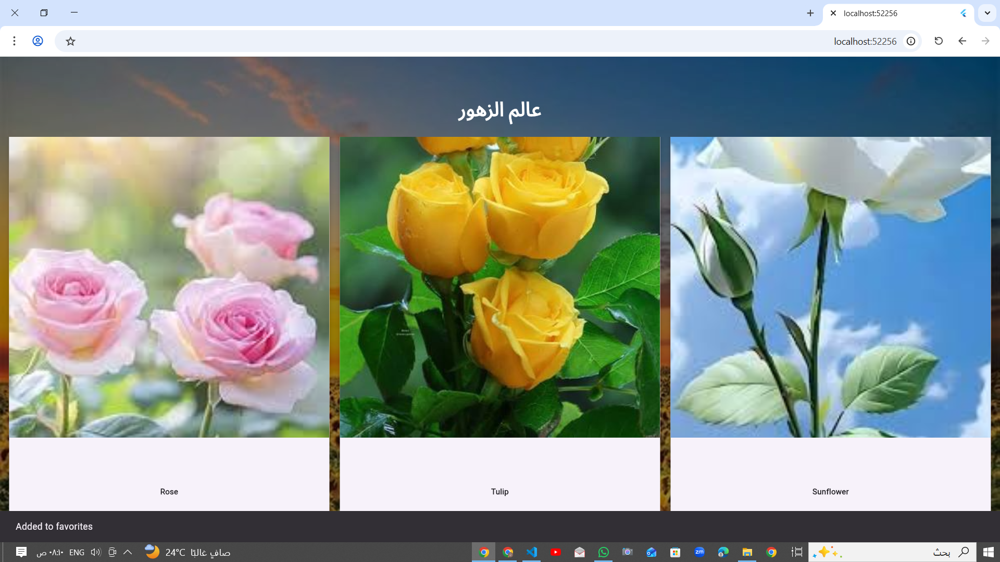
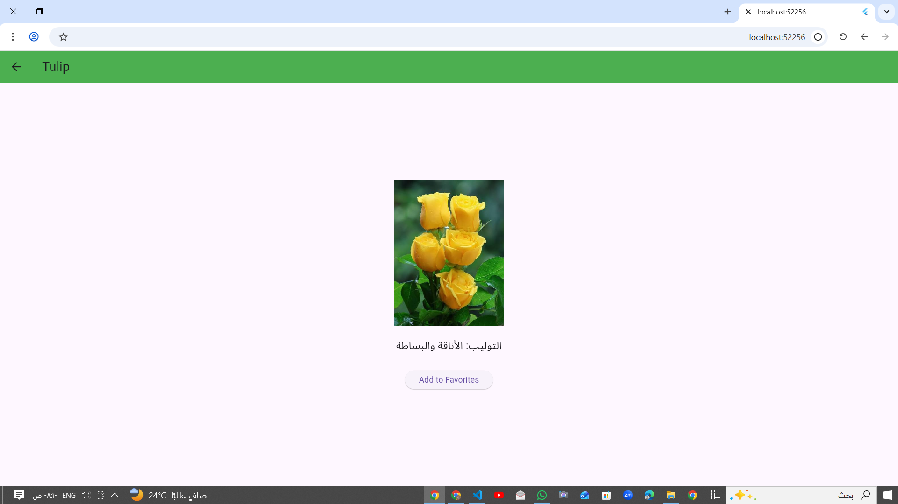

Flutter Flowers App
# #Project Description
This is a simple Flutter app that shows different types of flowers in a grid view.
Each flower has an image, name, and a short description.
When you click on a flower, it opens a new page with more details.
The app also uses navigation between screens and sends data back from the second screen.
# #Features
-Display flowers using GridView
-Show flower image and name
-Open details screen when clicking a flower
-Show description for each flower
-Return a message from details screen
-Show message using SnackBar

# #Tools Used
Flutter
Dart
# #How to Run
flutter pub get
flutter run
# #Output
Home Screen

Detail Screen
